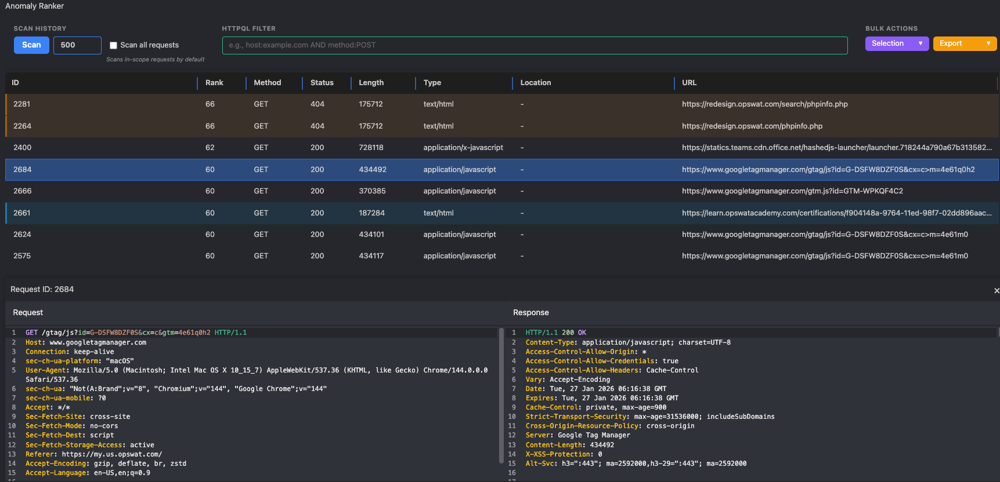
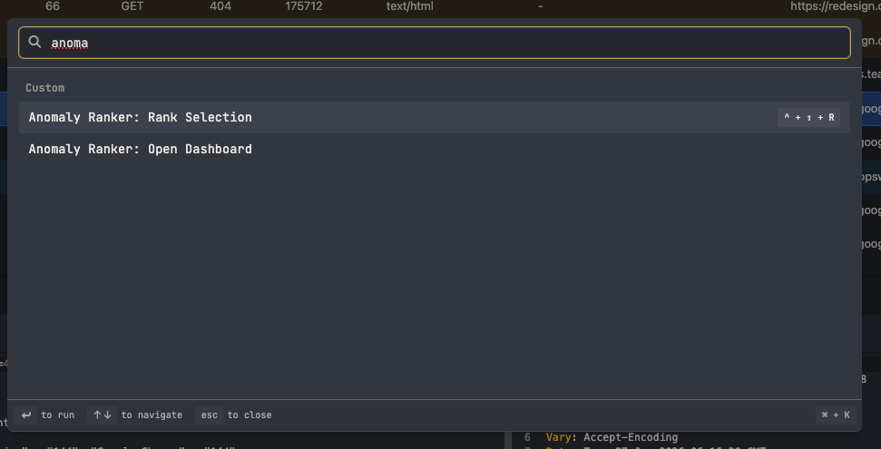
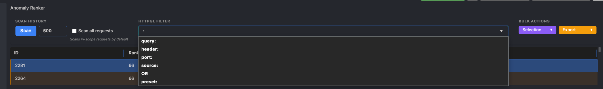

# Anomaly Ranker for Caido

Anomaly Ranker is a Caido plugin, Burp-inspired, that calculates an "Anomaly Rank" for multiple HTTP requests at once, so outliers in a cohort (a batch of similar requests) surface without manual diffing. It uses a categorical frequency scorer (v1.4) that replicates Burp Suite's anomaly-ranking behavior; SimHash and statistical hybrid scoring were removed (see v1.2 in [CHANGELOG.md](CHANGELOG.md)).

## Features

- **Rank by selection**: Context menu, command palette, or `Ctrl+Shift+R` (`Cmd+Shift+R` on macOS).
- **Burp-inspired scoring**: Categorical frequency model with raw and normalized ranks, plus per-feature explainability.
- **Fast at scale**: Bounded concurrency (50 parallel fetches) with pure feature extraction and no external ML dependencies.
- **Productive UI**: Filterable table with Raw column, expandable "Why anomalous?" panel, cohort warnings, viewer, and bulk actions.

## Screenshots







## Installation

1. Download the `plugin_package.zip` from the latest release.
2. Open Caido and navigate to the **Plugins** tab.
3. Click **Install Plugin** and select the downloaded zip file.
4. The **Anomaly Rank** sidebar item should appear immediately.

## Build from source

```bash
bun install
bun run build   # bundles the plugin into dist/plugin_package.zip
```

`bun run package` aliases `bun run build`; `bun run test` runs the Vitest suite (see `VALIDATION.md`).

## Anomaly Ranking Algorithm

Per response, sum `weight / frequency` over the attributes with more than one distinct value in the cohort, where `weight = 0.9^k` (`k` = distinct values for that attribute). `rawRank = round(10000 * sum)`; no-response entries score `-1` and are excluded. The 0-100 display rank is a min-max normalization of raw ranks across the cohort. Results sort by raw rank descending, then request id ascending.

The 10 attributes: status code, content length, body content, word count, line count, header names, colon count, visible text, visible word count, and tag names. The 3 HTML-derived attributes (visible text, visible word count, tag names) are computed only when the body is structurally HTML, else `0`. See [docs/algorithm.md](docs/algorithm.md) for the full per-attribute derivation and a worked example.

## Row Coloring (Crayon Rules)

The plugin uses standard security research color conventions:

| Condition | Color |
| :--- | :--- |
| **5xx** Server Error | Red |
| **4xx** Client Error | Amber |
| **3xx** Redirect | Olive |
| **2xx** + JSON | Green |
| **2xx** + XML | Blue |
| **2xx** + HTML | Cyan |
| Other **2xx** | Transparent |

## Usage

1. Navigate to **HTTP History** or **Search**, and select one or more requests to analyze.
2. Run **Anomaly Ranker: Rank Selection** via right-click menu, command palette (`Ctrl+K` / `Cmd+K`), or the `Ctrl+Shift+R` (`Cmd+Shift+R` on macOS) shortcut.
3. The **Anomaly Rank** sidebar opens with the results table: the table defaults to raw-rank-descending order (until you click a column header), the Rank cell turns bold red when normalized rank > 70, and row colors follow the Crayon table above.
4. Expand a row's **"Why anomalous?"** panel for the per-feature contribution breakdown, sorted by contribution descending.
5. Watch for cohort warnings above the table: small cohort (< 5 responses) or heterogeneous cohort (4+ features vary, or 2+ status classes present) - both mean the cohort may not be a fair like-for-like comparison. Use the **Selection** and **Export** dropdowns to process your findings.

## Limitations

- **Cohort-relative, not absolute.** A rank only means something relative to the other responses ranked with it; the same response in a different cohort gets a different rank.
- **Needs a comparable cohort.** Rank structurally similar requests (one endpoint under fuzzing, one parameter varied); ranking dissimilar endpoints together is not meaningful (and triggers the heterogeneous-cohort warning).

## Development

- **Frontend**: TypeScript + Vite
- **Backend**: QuickJS
- **Bundler**: `@caido-community/dev`

## Releasing

Bump the version in `package.json` and `manifest.json`, then push a `v*` tag (e.g. `v1.4.x`). GitHub Actions builds the plugin, signs the package with the `PRIVATE_KEY` secret, and publishes a GitHub release with the signed `plugin_package.zip`.

## Attribution & License

This plugin is an independent reimplementation inspired by Burp Suite's anomaly-ranking behavior. It is not affiliated with or endorsed by PortSwigger. "Burp" and "Burp Suite" are trademarks of PortSwigger Ltd. No Burp Suite code is included in this project.

## Credits

Based on the [Anomaly Ranker Burp Extension](https://github.com/aleister1102/AnomalyRankContextMenu) by aleister1102.
